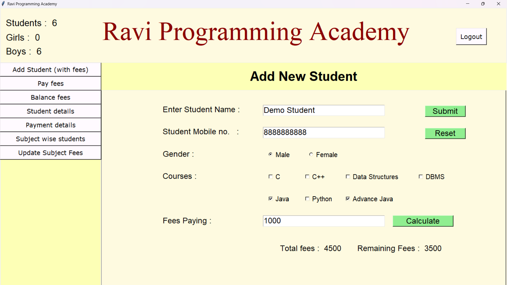

# 📊 Fees Management System

## 🎯 Objective
This project is a **Python-based Fees Management System** designed to streamline fee tracking and financial management processes for educational institutions or coaching classes. It provides an intuitive **Tkinter GUI** for seamless user interaction and leverages **SQLite3** as the backend database for efficient data storage and retrieval.

## 🛠 Tech Stack
- **Frontend:** Python (Tkinter)
- **Backend:** SQLite3 Database
- **Development Tools:** Visual Studio Code, PyCharm, SQLiteStudio

## 🚀 Features Implemented

### 🔹 Backend
- **Database Management**
  - SQLite3 database to store and manage fee-related data.
  - Secure data handling with structured tables and optimized queries.

- **Automated Fee Tracking**
  - Tracks student fee payments, pending dues, and generates transaction logs.
  - Reduces manual effort in maintaining financial records.

- **Error Handling & Testing**
  - Implemented robust error handling to prevent incorrect data entries.
  - Simulated real-world failures for reliability testing.

### 🔹 Frontend (Tkinter GUI)
- **User-Friendly Interface**
  - Interactive graphical user interface designed using Python Tkinter.
  - Simple navigation for adding, updating, and searching fee records.

- **Search & Filtering**
  - Allows users to search transactions by student name, payment status, and date.
  - Provides an organized display of fee records for quick access.

- **Data Visualization & Reporting**
  - Generates summary reports of total fees collected and pending dues.
  - Displays real-time updates on financial transactions.

## 📌 Required Software
- **Python 3.x** (must be installed before running the project)
- **SQLiteStudio** (for database visualization, optional but recommended)
- **PyCharm / VS Code** (for better development experience)

## 📬 Contact
📧 **Email:** vikaspuri1830@gmail.com  
🔗 **LinkedIn:** [http://www.linkedin.com/in/puri-vikas](#)  

## 📸 Project Screenshots

### 🎯 Dashboard View

👨‍💻 Authors

@VikasPuri

💬 Feedback

If you have any feedback, please reach out to us at vikaspuri1830@gmail.com
